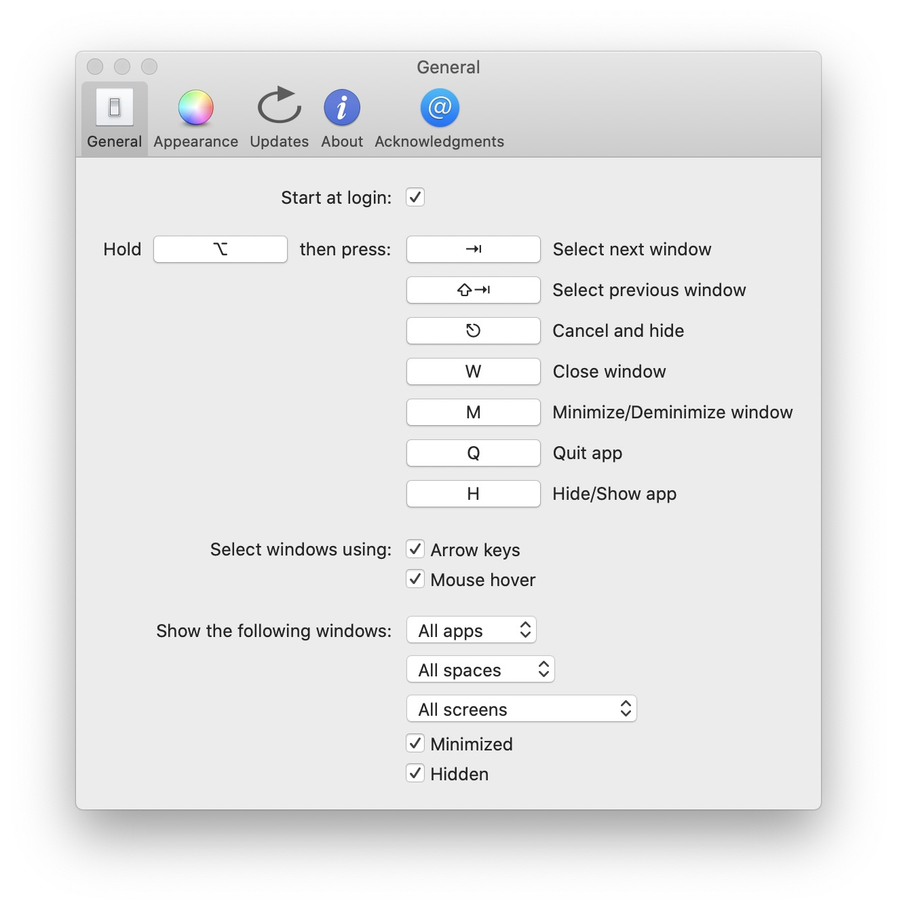

# alt-tab-macos

**alt-tab-macos** brings the power of Windows' "alt-tab" window switcher to macOS.

## Installation

[**Download the latest release**](https://github.com/lwouis/alt-tab-macos/releases/latest)

Alternatively, you can use [homebrew](https://brew.sh/): `brew cask install alt-tab`

## Compatibility

From macOS 10.12 to 10.15

## Localization

In addition to English, the app is currently available in:

* Deutsch
* Español
* Français
* Italiano
* Português (Brasil)
* Suomi
* Türkçe
* Русский язык
* 中文 (简体)
* 中文 (繁体)
* 日本語
* 한국어

[Contribute your own language easily!](https://poeditor.com/join/project/8AOEZ0eAZE)

## Configuration

* Change the shortcut key, switch to a Windows theme and more, using the Preferences window:

## Contributing

* [CONTRIBUTING.md](docs/CONTRIBUTING.md) gives an overview of the project for newcomers who want to contribute.
* Come discuss with us on the [Discord server](https://discord.gg/mHvmcqT).
* [Suggest an enhancement or discuss an issue on github](https://github.com/lwouis/alt-tab-macos/issues). You can also use the feedback form within the app.

Our lovely contributors:

## Alternatives

Before building my own app, I looked around at similar apps. However, none was completely satisfactory so I rolled my own. Also, the almost-good-enough apps are not open-source.

| Alternative                                                                                 | Differences                                                                                                  |
|---------------------------------------------------------------------------------------------|--------------------------------------------------------------------------------------------------------------|
| [HyperSwitch](https://bahoom.com/hyperswitch) and [HyperDock](https://bahoom.com/hyperdock) | Closed-source. Thumbnails are too small. App icon is on top of the thumbnail                                 |
| [WindowSwitcher](https://www.noteifyapp.com/windowswitcher/)                                | 7$. Thumbnails are small and blurry. App icon is on top of the thumbnail                                     |
| [Switch](https://github.com/numist/Switch)                                                  | Open Source. Thumbnails are small. Very little customization. Latest release is from 2016                     |
| [Witch](https://manytricks.com/witch/) and [Context](https://contexts.co/)                  | 10-15$. Closed-source. Focus on text. No thumbnails                                                          |
| Built-in [MissionControl](https://en.wikipedia.org/wiki/Mission_Control_\(macOS\))          | No keyboard support                                                                                          |
| `⌘ command` + `⇥ tab`                                                                     | Only shows apps, not windows (note: can press down to see window of selected app)                            |
| `⌘ command` + `` ` ``                                                                      | Cycles through tabs and windows, but only of the same app. Only cycling, no direct access                    |

## Screenshots

| 1 row | 2 rows | Windows theme |
|-------|---------|-------|
|  |  |  |
