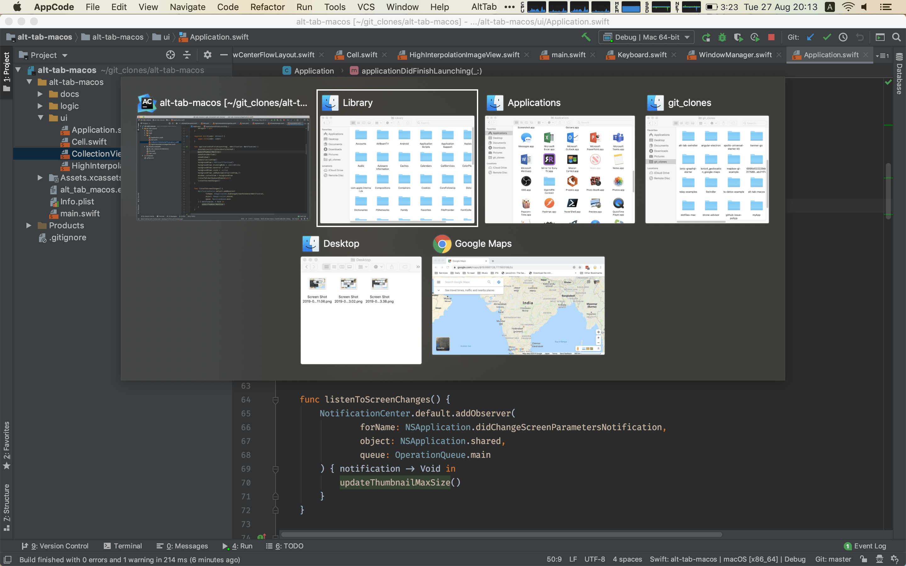

# [Download the latest release](https://github.com/lwouis/alt-tab-macos/releases/latest/download/alt-tab-macos.zip)

# Purpose

`alt-tab-macos` brings the brilliant Windows 10 window switcher (activated by pressing alt-tab) to macOS users.It lets the user switch between windows in a visual way.

On macOS there is an app cycling shortcut which doesn't let you select between windows of an app, and there is Mission Control which doesn't let you navigate using the keyboard.

# How to use

* `control` + `tab` cycles through apps
* `control` + `shift` + `tab` cycles through apps in reverse
* Quick press-and-release will cycle through apps without showing any UI
* Holding `control` after pressing a cycle shortcut will show the UI
* Releasing `control` or clicking on a window will focus it

# Features

* Delay before showing the UI to avoid flashing (default 200ms)
* High quality thumbnails of all windows
* Background uses macOS vibrancy UX
* UI elements have a subtle shadow to ensure readability
* Window titles will truncate with an ellipsis if they don't fit
* Thumbnails have a maximum width and height to help visualize very long, tall, small, big windows
* Fast. There is no benchmark at the moment but energy was spent making sure the UI is responsive

# Alternatives

Before building my own app, I looked around at similar apps. However, none was completely satisfactory so I rolled my own. Also the almost-good-enough apps are not open-source.

* [HyperSwitch](https://bahoom.com/hyperswitch) and [HyperDock](https://bahoom.com/hyperdock)  
  Free but closed-source. Things I would change: thumbnails are too small, app icon is on top of the thumbnail
* [Witch](https://manytricks.com/witch/) and [Context](https://contexts.co/)  
  10-15$. focus on text instead of thumbnails
* Built-in [MissionControl](https://en.wikipedia.org/wiki/Mission_Control_(macOS\))  
  No keyboard support
* Command-tab  
  Only see apps, not windows (note: can press down to see window of selected app)
* Command-`  
  Cycles through tabs and windows, but only of the same app. No direct access
  
# Screenshots

