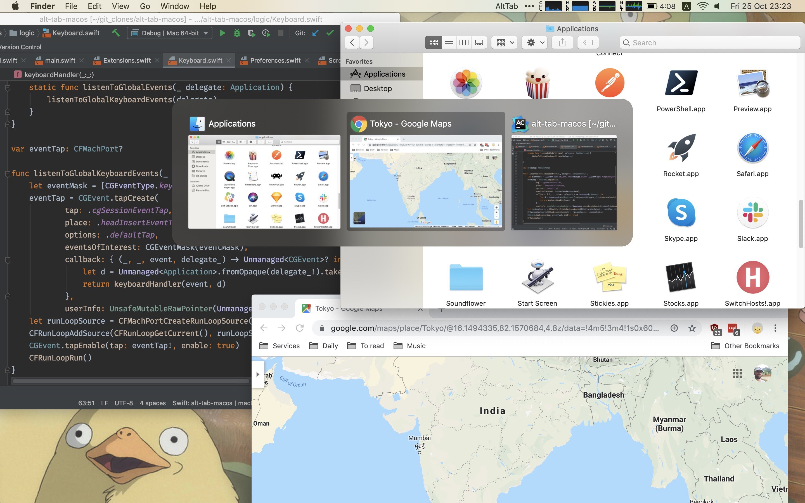
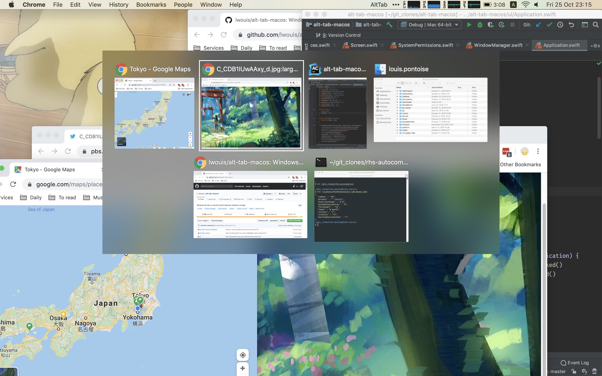

# alt-tab-macos

**alt-tab-macos** brings the power of Windows' "alt-tab" window switcher to macOS.

## Installation

[**Download the latest release**](https://github.com/lwouis/alt-tab-macos/releases/latest)
and extract it in your Applications folder. If macOS refuses to run the application
because it's from an unidentified developer, right-click the application,
choose **Open** then click **Open** in the prompt that appears.

## Compatibility

From macOS 10.12 to 10.15

## Usage

* Press `⌥ option` + `⇥ tab` to shows the thumbnails.
* Hold `⌥ option` and press `⇥ tab` to select the next thumbnail.
* Hold `⌥ option` and press `⇧ shift` + `⇥ tab` to select the previous thumbnail.
* Release `⌥ option` to switch focus to the window.

**Extra:**

* You hover and click with the `🖱️ mouse`.
* You cycle with `⇦ left arrow` and `⇨ right arrow`.
* You can cancel with `⎋ escape`.

## Configuration

* Change the shortcut key, switch to a Windows theme and more, using the Preferences window.
* If you like scriptable/portable configuration, you can edit `~/Library/Preferences/alt-tab-macos.json`.

## Community

Come discuss with us on the [Discord server](https://discord.gg/mHvmcqT).

## Alternatives

Before building my own app, I looked around at similar apps. However, none was completely satisfactory so I rolled my own. Also, the almost-good-enough apps are not open-source.

| Alternative                                                                                 | Differences                                                                                                  |
|---------------------------------------------------------------------------------------------|--------------------------------------------------------------------------------------------------------------|
| [HyperSwitch](https://bahoom.com/hyperswitch) and [HyperDock](https://bahoom.com/hyperdock) | Closed-source. Thumbnails are too small. App icon is on top of the thumbnail                                 |
| [WindowSwitcher](https://www.noteifyapp.com/windowswitcher/)                                | 7$. Thumbnails are small and blurry. App icon is on top of the thumbnail                                     |
| [Switch](https://github.com/numist/Switch)                                                  | Open Source. Thumbnails are small. Very little customization. Latest release is from 2016                     |
| [Witch](https://manytricks.com/witch/) and [Context](https://contexts.co/)                  | 10-15$. Closed-source. Focus on text. No thumbnails                                                          |
| Built-in [MissionControl](https://en.wikipedia.org/wiki/Mission_Control_\(macOS\))          | No keyboard support                                                                                          |
| `⌘ command` + `⇥ tab`                                                                     | Only shows apps, not windows (note: can press down to see window of selected app)                            |
| `⌘ command` + `` ` ``                                                                      | Cycles through tabs and windows, but only of the same app. Only cycling, no direct access                    |

## Building the project locally

This project has minimal dependency on Xcode-only features (e.g. InterfaceBuilder, Playgrounds). You can build it using 1 command `xcodebuild`.

Note that on debug builds, to avoid having to re-check the `System Preferences > Security & Privacy` permissions on every build, we use a code-signing certificate. You can generate one on your local machine in one step by running `ci/generate_debug_certificate.sh`.

If you want to contribute a PR, please run `npm install` once. It will add the pre-commit hook to ensure that your commits follow the convention and will pass the PR.

## Screenshots

### 1 row

### 2 rows

### Windows theme

