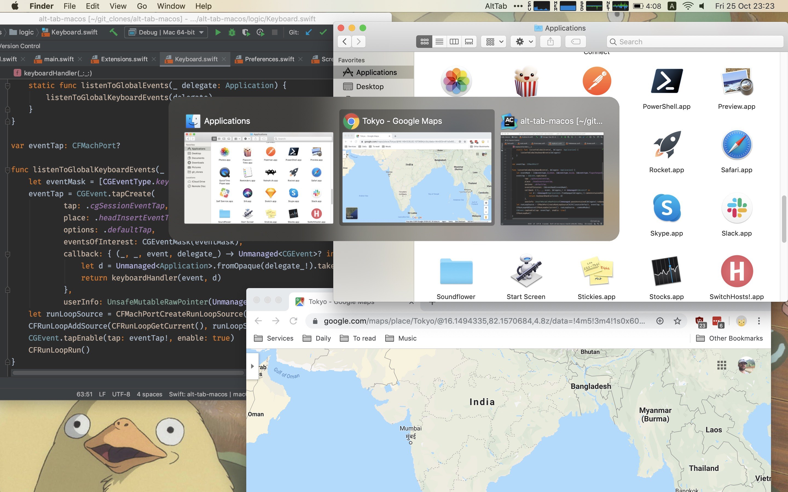

# AltAtlTab

**AltAtlTab** is a lightly rebranded fork of AltTab v10.12.0.

[Original project](https://github.com/lwouis/alt-tab-macos) 15K stars | [Download](https://github.com/lwouis/alt-tab-macos/releases/download/v10.12.0/AltTab-10.12.0.zip) 7.4M downloads
-|-

  
Project supported by

  

