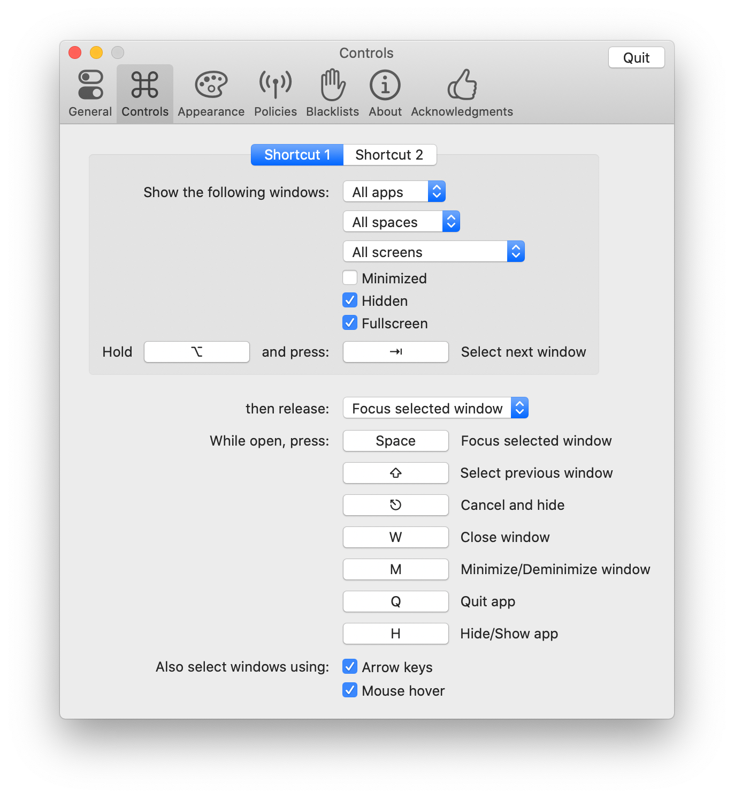
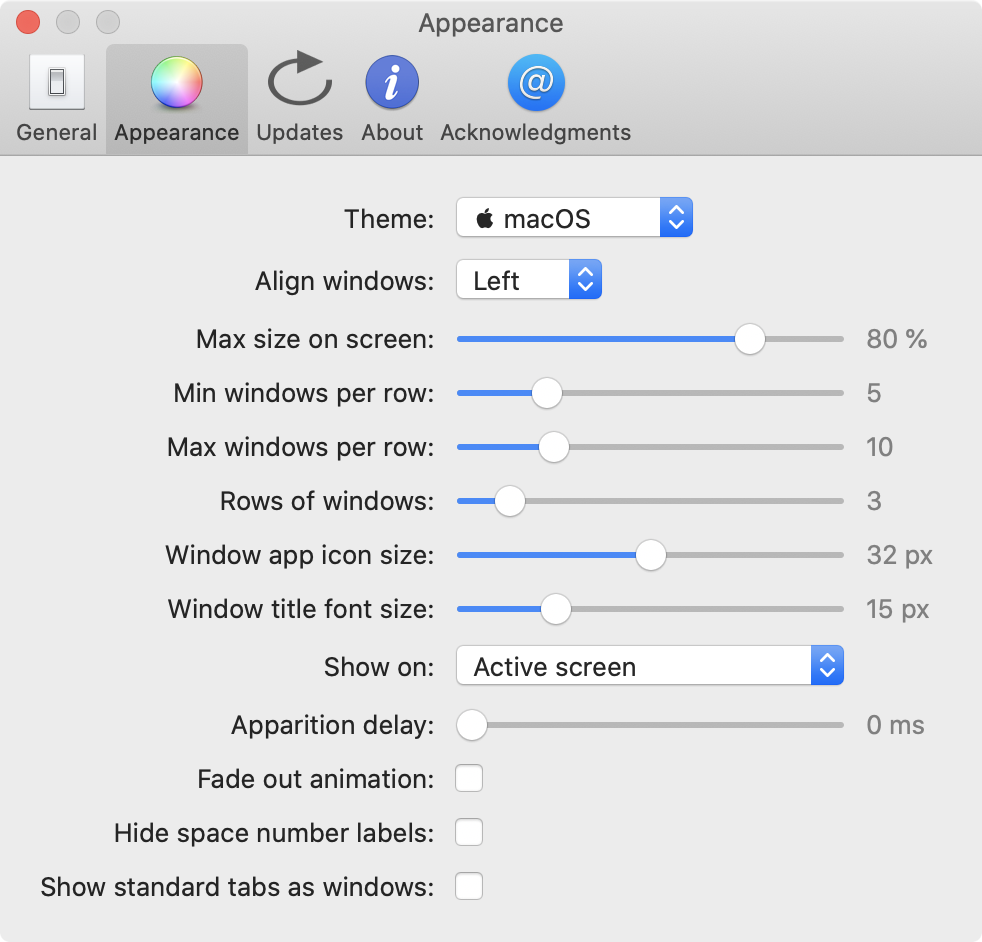

# Introduction

**AltTab** brings the power of Windows's "alt-tab" window switcher to macOS.

## Installation

[**Download the latest release**]({{ site.github.latest_release.assets[0].browser_download_url }})

Alternatively, you can use [homebrew](https://brew.sh/): `brew cask install alt-tab`

## Compatibility

From macOS 10.12 to 10.15

## Localization

In addition to English, the app is currently available in:

| Deutsch | Nederlands | العربية |
| Español | Português (Brasil) | 中文 (简体) |
| Français | Suomi | 中文 (繁体) |
| Italiano | Türkçe | 日本語 |
| Magyar | Русский язык | 한국어 |

[Contribute your own language easily!](https://poeditor.com/join/project/8AOEZ0eAZE)

## Configuration

Change the shortcut keys, switch to a Windows theme and more, using the Preferences window:

| |  |

## Alternatives

Before building my own app, I looked around at similar apps. However, none was completely satisfactory so I rolled my own. Also, the almost-good-enough apps are not open-source.

| Alternative                                                                                 | Differences                                                                                                  |
|---------------------------------------------------------------------------------------------|--------------------------------------------------------------------------------------------------------------|
| [HyperSwitch](https://bahoom.com/hyperswitch) and [HyperDock](https://bahoom.com/hyperdock) | $10. Closed-source. Thumbnails are too small. App icon is on top of the thumbnail                            |
| [WindowSwitcher](https://www.noteifyapp.com/windowswitcher/)                                | $7. Closed-source. Thumbnails are small and blurry. App icon is on top of the thumbnail                      |
| [Switch](https://github.com/numist/Switch)                                                  | Open Source. Thumbnails are small. Very little customization. Latest release is from 2016                    |
| [Witch](https://manytricks.com/witch/) and [Context](https://contexts.co/)                  | $10-15. Closed-source. Focus on text. No thumbnails                                                          |
| [MissionControl Plus](https://www.fadel.io/missioncontrolplus)                              | $10. Closed-source. No chronology and order to windows. Hard to navigate windows with keyboard               |
| Built-in [MissionControl](https://en.wikipedia.org/wiki/Mission_Control_\(macOS\))          | No keyboard support                                                                                          |
| Built-in `⌘ command` + `⇥ tab`                                                              | Only shows apps, not windows (note: can press down to see window of selected app)                            |
| Built-in `⌘ command` + `` ` ``                                                              | Cycles through tabs and windows, but only of the same app. Only cycling, no direct access                    |

There are also related apps which don't really overlap in functionality, but target similar needs: [Swish](https://highlyopinionated.co/swish/), [Hookshot](https://hookshot.app/), [BetterTouchTool](https://folivora.ai/), [Magnet](https://magnet.crowdcafe.com/), [Spectacles](https://www.spectacleapp.com/), [yabai](https://github.com/koekeishiya/yabai), [LayAuto](https://layautoapp.com/), [OptimalLayout](http://most-advantageous.com/optimal-layout/), [BetterTouchTool](https://folivora.ai/), [BetterSnapTool](https://folivora.ai/bettersnaptool), [Moom](https://manytricks.com/moom/)

## Screenshots

| 1 row | 2 rows | Windows theme |
|-------|---------|-------|
|  |  |  |

## License

AltTab is under the [GPL-3.0 license](https://github.com/lwouis/alt-tab-macos/blob/master/LICENCE.md). 
