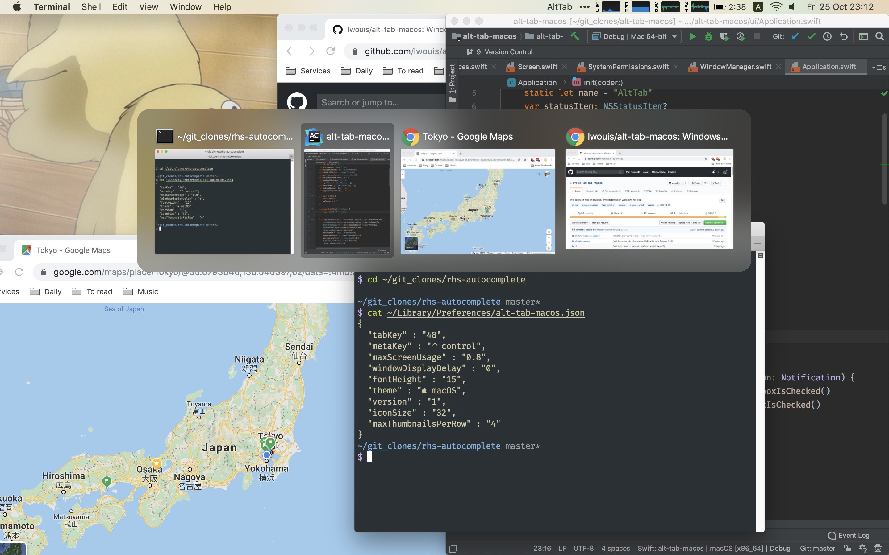
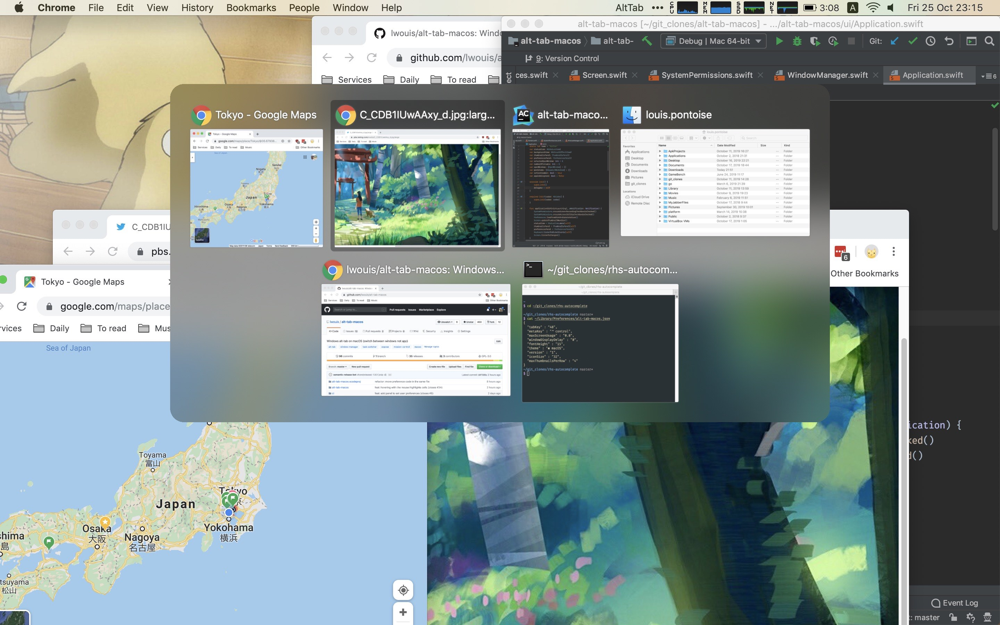
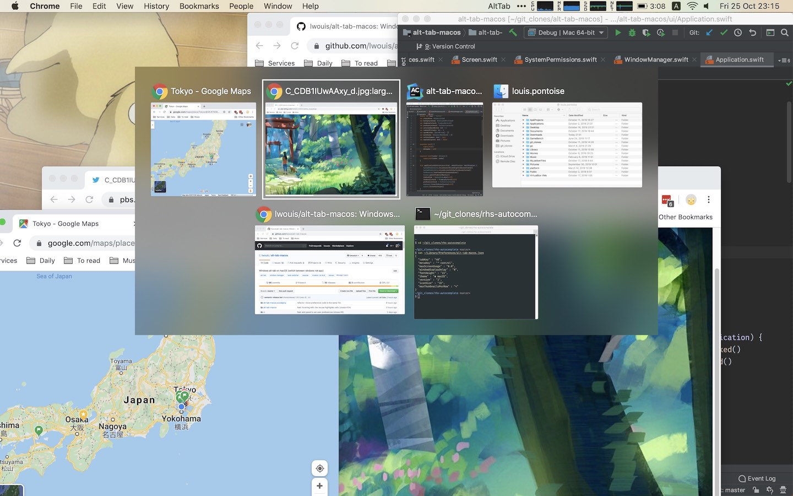

# Introduction

**AltTab** brings the power of Windows’s "alt-tab" window switcher to macOS.

## Features

* Switch focus to any window
* Minimize, close, fullscreen any window
* Hide, quit any app
* Customize AltTab appearance (e.g. show app badges, Space numbers, increase icon, thumbnail, title size, etc)
* Custom trigger shortcuts with almost any key
* Blacklist apps you don’t want to list or trigger AltTab from
* Dark Mode
* Drag-and-drop things on top of window thumbnails
* Right-to-left languages and UI
* Accessibility: VoiceOver, sticky keys, reduced transparency, etc

## Installation

[**Download the latest release**]({{ site.github.latest_release.assets[0].browser_download_url }})

Alternatively, you can use [homebrew](https://brew.sh/):

| Homebrew 2.7 and above | Homebrew 2.5 and 2.6 | Homebrew 2.4 and below             |
|------------------------|----------------------|------------------------------------|
| `brew install --cask alt-tab` | `brew install alt-tab` | `brew cask install alt-tab`        |

## Compatibility

* __macOS version:__ from 10.12 to latest
* __Apple Silicon:__ yes, AltTab is [universal](https://developer.apple.com/documentation/apple-silicon/porting-your-macos-apps-to-apple-silicon)

## Localization

AltTab is available in: Bahasa Indonesia, Català, Dansk, Deutsch, Eesti keel, English, Español, Français, Galego, Hrvatski, Italiano, Kurdî, Lëtzebuergesch, Limba română, Magyar, Nederlands, Norsk, Oʻzbekcha, Polski, Português, Português (Brasil), Shqip, Slovenčina, Slovenščina, Suomi, Svenska, Tiếng Việt, Türkçe, Čeština, Ελληνικά, Български, Русский язык, Српски / Srpski, українська мова, עִבְרִית ,العربية ,فارسی, हिन्दी, বাংলা, தமிழ், 日本語, 简体中文, 繁體中文, 한국어

[Contribute your own language easily!](https://poeditor.com/join/project/8AOEZ0eAZE)

## Privacy and respecting the user

* AltTab doesn’t upload or download any data without the user explicitly asking for it (e.g. asking to update the app, sending a crash report, etc)
* AltTab uses as few resources as possible: CPU, memory, disk, etc. The app footprint is small (e.g. small disk size, minimal CPU use in the background, etc)

## Configuration

Change the shortcut keys, switch to a Windows theme and more, using the Preferences window:

|  |  |
|  |  |
|  | |

## Alternatives

Before building my own app, I looked around at similar apps. However, none was completely satisfactory so I rolled my own. Also, the almost-good-enough apps are not open-source.

| Alternative                                                                                 | Differences                                                                                                  |
|---------------------------------------------------------------------------------------------|--------------------------------------------------------------------------------------------------------------|
| [HyperSwitch](https://bahoom.com/hyperswitch) and [HyperDock](https://bahoom.com/hyperdock) | $10. Closed-source. Thumbnails are too small. App icon is on top of the thumbnail                            |
| [WindowSwitcher](https://www.noteifyapp.com/windowswitcher/)                                | $7. Closed-source. Thumbnails are small and blurry. App icon is on top of the thumbnail                      |
| [Switch](https://github.com/numist/Switch)                                                  | Open Source. Thumbnails are small. Very little customization. Latest release is from 2016                    |
| [Witch](https://manytricks.com/witch/) and [Contexts](https://contexts.co/)                 | $10-15. Closed-source. Focus on text. No thumbnails                                                          |
| [MissionControl Plus](https://www.fadel.io/missioncontrolplus)                              | $10. Closed-source. No chronology and order to windows. Hard to navigate windows with keyboard               |
| Built-in [MissionControl](https://en.wikipedia.org/wiki/Mission_Control_(macOS))            | No keyboard support                                                                                          |
| Built-in `⌘ command` + `⇥ tab`                                                              | Only shows apps, not windows (note: can press down to see window of selected app)                            |
| Built-in `⌘ command` + `` ` ``                                                              | Cycles through tabs and windows, but only of the same app. Only cycling, no direct access                    |

There are also related apps which don’t really overlap in functionality, but target similar needs: [Swish](https://highlyopinionated.co/swish/), [Hookshot](https://hookshot.app/), [Magnet](https://magnet.crowdcafe.com/), [Spectacle](https://www.spectacleapp.com/), [Rectangle](https://github.com/rxhanson/Rectangle), [yabai](https://github.com/koekeishiya/yabai), [LayAuto](https://layautoapp.com/), [OptimalLayout](http://most-advantageous.com/optimal-layout/), [BetterTouchTool](https://folivora.ai/), [BetterSnapTool](https://folivora.ai/bettersnaptool), [Moom](https://manytricks.com/moom/), [uBar](https://brawersoftware.com/products/ubar).

## More screenshots

| 1 row | 2 rows | Windows theme |
|-------|---------|-------|
|  |  |  |

## License

AltTab is under the [GPL-3.0 license](https://github.com/lwouis/alt-tab-macos/blob/master/LICENCE.md). 
