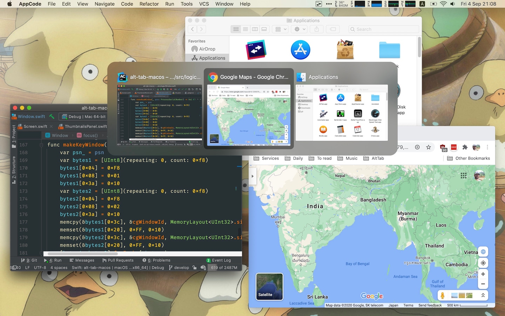
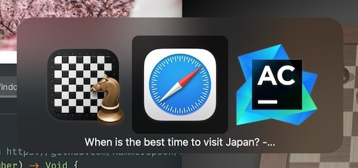
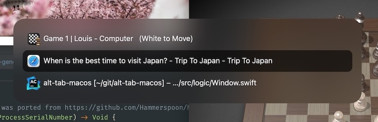
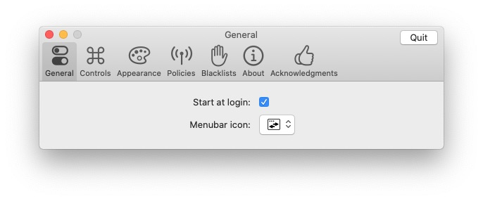
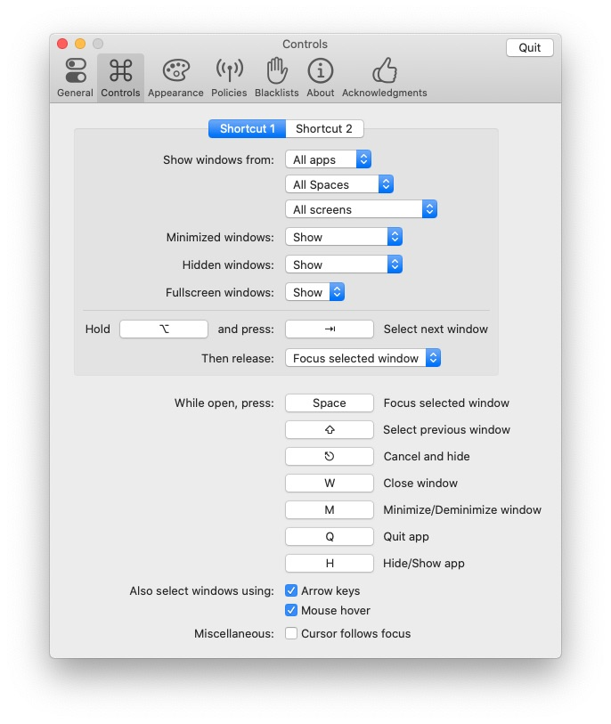
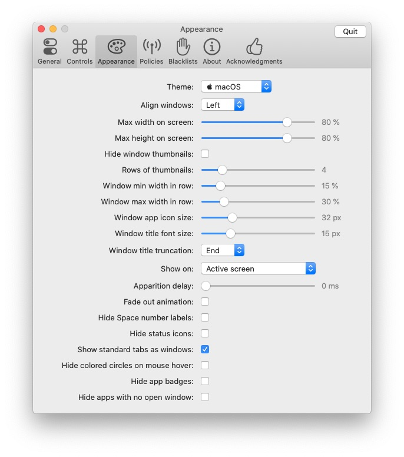
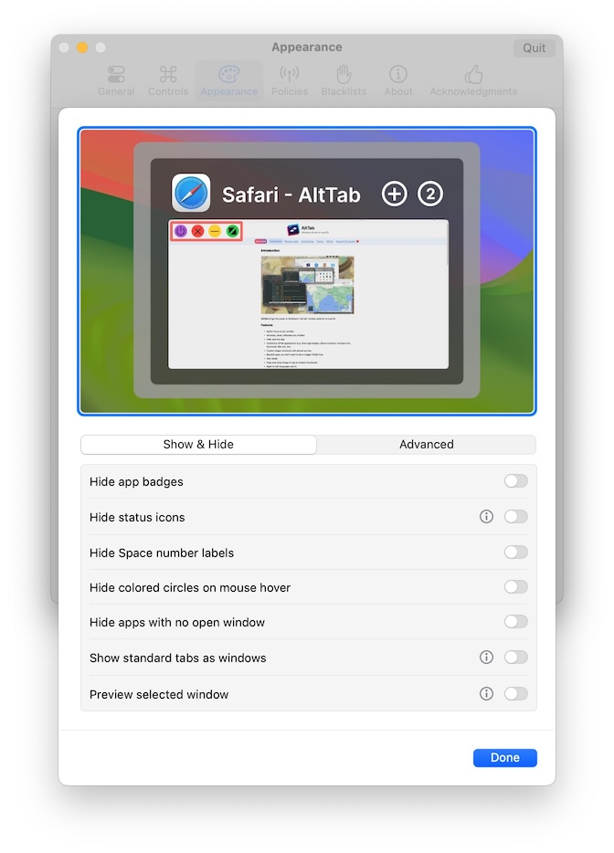
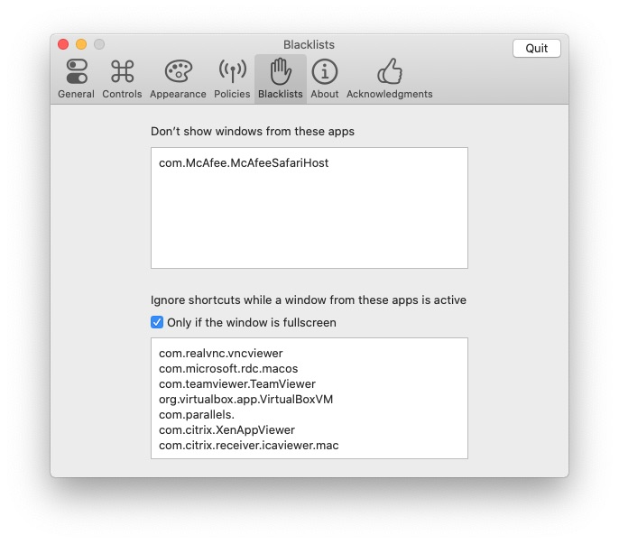
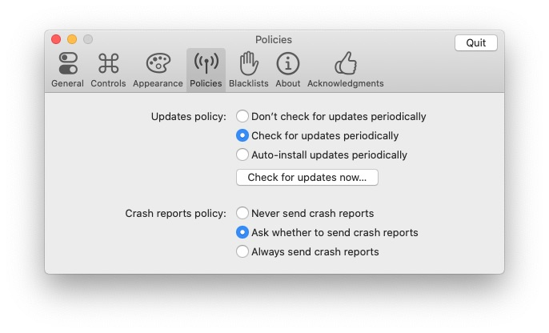

Alternative Styles

    
    

## Installation

* [**Download the latest release**]({{ site.github.latest_release.assets[0].browser_download_url }})
* Alternatively, you can use [homebrew](https://brew.sh/): `brew install --cask alt-tab`

## Features

* Switch focus to any window
* Minimize, close, fullscreen any window; Hide, quit any app
* Customize AltTab appearance (pick one of 3 styles, then customize further)
* Custom trigger shortcuts with almost any keys
* Blacklist apps you don’t want to list or trigger AltTab from
* Light and Dark Appearance
* Drag-and-drop things on top of window thumbnails
* Accessibility: VoiceOver, sticky keys, reduced transparency, etc

## Compatibility

* __macOS version:__ from 10.12 to latest
* __Apple Silicon:__ yes, AltTab is [universal](https://developer.apple.com/documentation/apple-silicon/porting-your-macos-apps-to-apple-silicon)

## Localization

AltTab is available in many languages: Bahasa Indonesia, Basa Jawa, Català, Čeština, Dansk, Deutsch, Eesti keel, English, Español, Français, Gaeilge, Galego, Hrvatski, Íslenska, Italiano, Kurdî, Lietuvių, Lëtzebuergesch, Magyar, Nederlands, Norsk Bokmål, Norsk Nynorsk, Oʻzbekcha, Polski, Português, Português (Brasil), Română, Shqip, Slovenčina, Slovenščina, Suomi, Svenska, Tiếng Việt, Türkçe, Беларуская мова, Български, Русский, Српски, Українська, Ελληνικά, עִבְרִית, العربية, فارسی, हिन्दी, বাংলা, ગુજરાતી, தமிழ், ಕನ್ನಡ, മലയാളം, ภาษาไทย, 日本語, 简体中文, 繁體中文, 繁體中文 (香港), 한국어

[Contribute your own language easily!](https://poeditor.com/join/project/8AOEZ0eAZE)

## Privacy

AltTab doesn’t communicate to any server for so-called telemetry. AltTab will only use the network if it's absolutely required (e.g. checking for updates).

## Performance

AltTab has been designed to take as few resources as possible on the user computer. The app itself is kept as small as possible. CPU usage is kept to a minimum, especially while in the background. The goal is to respect the user and try to have no negative impact on their experience.

## Configuration

Change the shortcut keys, switch to a Windows theme and more, using the Settings window:

    
    
    
    
    
    

## CLI usage

You can run CLI commands directly on the executable inside the .app bundle (e.g. `/Applications/AltTab.app/Contents/MacOS/AltTab`)

* `AltTab --list` will return the list of windows (ID and title) in JSON
* `AltTab --detailed-list` will return the list of windows (lots of info) in JSON
* `AltTab --show=shortcut_index` will show AltTab UI, as if the corresponding shortcut was pressed
* `AltTab --focus=window_id` will focus the window with the specified ID (get it from --list)
* `AltTab --focusUsingLastFocusOrder=focus_order` will focus the window with the specified focus-order (get it from --detailed-list)

For this to work, you need AltTab.app to be running, to keep track of the state of windows, and execute the commands

## Alternatives

Before building my own app, I looked around at similar apps. However, none was completely satisfactory so I rolled my own. Also, the almost-good-enough apps are not open-source.

| Alternative                                                                                 | Differences                                                                                                  |
|---------------------------------------------------------------------------------------------|--------------------------------------------------------------------------------------------------------------|
| [HyperSwitch](https://bahoom.com/hyperswitch) and [HyperDock](https://bahoom.com/hyperdock) | $10. Closed-source. Thumbnails are too small. App icon is on top of the thumbnail                            |
| [WindowSwitcher](https://www.noteifyapp.com/windowswitcher/)                                | $7. Closed-source. Thumbnails are small and blurry. App icon is on top of the thumbnail                      |
| [Switch](https://github.com/numist/Switch)                                                  | Open Source. Thumbnails are small. Very little customization. Latest release is from 2016                    |
| [Witch](https://manytricks.com/witch/) and [Contexts](https://contexts.co/)                 | $10-15. Closed-source. Focus on text. No thumbnails                                                          |
| [MissionControl Plus](https://www.fadel.io/missioncontrolplus)                              | $10. Closed-source. No chronology and order to windows. Hard to navigate windows with keyboard               |
| Built-in [MissionControl](https://en.wikipedia.org/wiki/Mission_Control_(macOS))            | No keyboard support                                                                                          |
| Built-in `⌘ command` + `⇥ tab`                                                              | Only shows apps, not windows (note: can press down to see window of selected app)                            |
| Built-in `⌘ command` + `` ` ``                                                              | Cycles through tabs and windows, but only of the same app. Only cycling, no direct access                    |

There are also related apps which don’t really overlap in functionality, but target similar needs: [Swish](https://highlyopinionated.co/swish/), [Hookshot](https://hookshot.app/), [Magnet](https://magnet.crowdcafe.com/), [Spectacle](https://www.spectacleapp.com/), [Rectangle](https://github.com/rxhanson/Rectangle), [yabai](https://github.com/koekeishiya/yabai), [LayAuto](https://layautoapp.com/), [BetterTouchTool](https://folivora.ai/), [BetterSnapTool](https://folivora.ai/bettersnaptool), [Moom](https://manytricks.com/moom/), [uBar](https://brawersoftware.com/products/ubar).

## License

AltTab is under the [GPL-3.0 license](https://github.com/lwouis/alt-tab-macos/blob/master/LICENCE.md). 
