# Pro Transition — Complete UI Specification

> **Line coverage:** `ProTransitionManagerTestable.swift` 100% · _refreshed 2026-05-27 by `/coverage-explore`_

---

## State Diagram

```mermaid
flowchart TD
    Start([App launched]) --> A["<b>[A] Welcome Letter</b><br/>Day 1<br/>(copy varies by fresh install vs upgrade)"]
    A --> Day4Check{"Day 4<br/>first switcher open?"}
    Day4Check -->|Yes| H["<b>[H] Day 4 Pro Tour Popover</b>"]
    Day4Check -->|"No switcher use"| SkipH["Skipped"]
    H --> Silent["Silent trial<br/>Days 5-11"]
    SkipH --> Silent

    Silent --> D12{"Day 12<br/>Active at 10-11:30 or 15:30-17?"}
    D12 -->|Yes| B["<b>[B] Heads-Up Popover</b>"]
    D12 -->|No| SkipB["Skipped"]
    B --> Badge["Badge dot on icon<br/>Days 13-14"]
    SkipB --> Badge

    Badge --> Exp["<b>Day 15: Trial expired</b><br/>Remove badge dot<br/>Degradable feature (Auto size) downgrades immediately;<br/>style/shortcutStyle also downgrade. First switcher use<br/>post-expiry triggers free-pass + [C] for any user;<br/>engaged users also get one last Pro switcher session<br/>(read() returns remembered values during free-pass)"]

    Exp --> Fork{"First event<br/>after expiration?"}
    Fork -->|"Hard-gated feature triggered<br/>(search, shortcut ≥ 2)"| FP["Free pass<br/>Execute action once"]
    Fork -->|"First switcher open"| FP
    Fork -->|"10-11:30 or 15:30-17 arrives<br/>no trigger fired"| D["<b>[D] Proactive Day 15</b>"]
    Fork -->|"No activity"| RetryD["Retry next day"]
    RetryD --> Fork

    FP --> C["<b>[C] Full Upgrade Window</b>"]
    C --> PostC["Hard-gate now active"]

    D --> Fork2{"Hard-gated feature<br/>triggered later?"}
    Fork2 -->|Yes| FP2["Free pass<br/>Execute action once"]
    Fork2 -->|"Never — only<br/>degradable features used"| ToD21["To Day 21"]
    FP2 --> C

    PostC --> D21{"Day 21+<br/>Active at 10-11:30 or 15:30-17?"}
    ToD21 --> D21
    D21 -->|Yes| F["<b>[F] Day 21 Popover</b>"]
    D21 -->|"Inactive until Day 35"| SkipF["Skip Day 21"]

    F --> D35{"Day 35+<br/>Active at 10-11:30 or 15:30-17?"}
    SkipF --> D35
    D35 -->|Yes| G["<b>[G] Day 35 Final Window</b>"]
    D35 -->|"Inactive until Day 49"| GiveUp["Give up"]

    G -->|"Get Pro"| P(["✓ Purchased<br/>All prompts stop, all gates removed"])
    G -->|"Don't ask again"| OO(["Opted out"])
    G -->|"Close ×"| SS

    GiveUp --> SS(["<b>Steady State</b><br/>E popover on every hard-gate attempt<br/>Degradable: silent fallback<br/>Purchase in Preferences"])
    OO --> SS
```

**Note:** Purchase at any point in the flow → all prompts stop, all gates removed, all indicators cleared. This exit applies from every state.

**Note:** [E] Hard-Gate Popover runs in parallel from the moment hard-gate is active. Any hard-gated feature attempt → [E]. This continues in Steady State, even after opt-out.

---

## State Variables

| Variable | Default | Description |
|---|---|---|
| `hasSeenWelcome` | false | [A] shown |
| `hasSeenDay4Tour` | false | [H] Day 4 Pro tour popover shown |
| `hasSeenDay12` | false | [B] shown |
| `freePassUsed` | false | One-time post-trial free pass consumed |
| `hasSeenFullUpgrade` | false | [C] shown |
| `hasSeenProactiveDay15` | false | [D] shown |
| `hasSeenDay21` | false | [F] shown |
| `hasSeenDay35` | false | [G] shown |
| `userOptedOut` | false | "Don't ask again" clicked |
| `hasTriggeredPostExpirationSwitcher` | false | First post-expiration switcher summon consumed the free-pass via the appearance/shortcut hard-gate trigger (one-shot) |
| `rememberedAppearanceStyle` | nil | Snapshot of Pro `appearanceStyle` at `onProLockEngaged()`. Drives the ghost outline in Settings; also passed into the [C] header reason so engaged users see a tailored title |
| `rememberedAppearanceSize` | nil | Snapshot of `.auto` size at `onProLockEngaged()` — drives the gray overlay on the `.auto` segment |
| `rememberedShortcutStyle` | nil | Snapshot of `.searchOnRelease` at `onProLockEngaged()`. Drives the gray background on the dropdown item; also passed into the [C] header reason so search-engaged users see a tailored title |

**Implementation note:** `hasPurchased` is not stored — it is derived from `LicenseManager.shared.state == .pro`. All day references in the spec are 1-indexed (Day 1 = first day); in code, `daysSinceTrialStart` is 0-indexed (Day 1 = 0, Day 12 = 11, Day 15 = 14).

---

## UI Components

| | **[A] Welcome Letter** | **[H] Day 4 Pro Tour** | **[B] Day 12 Heads-Up** | **[C] Full Upgrade** | **[D] Proactive Day 15** | **[E] Hard-Gate Popover** | **[F] Day 21 Reminder** | **[G] Day 35 Final** |
|---|---|---|---|---|---|---|---|---|
| **Trigger** | First launch after install or update — copy varies by which (fresh install detected via nil `preferencesVersion` at migration) | First switcher open on Day 4 (after dismissal + 1s) | Day 12, at 10–11:30 or 15:30–17:00 | First hard-gated feature after free pass used; or first hard-gate if [D] was shown but free pass not yet used → free pass fires first, then [C]. Also: first switcher open after Day 15 → free-pass + [C] (after dismissal + 1s), for any user (engaged users see a tailored header from `remembered*`; non-engaged users see the `.nonEngaged` fallback) | Day 15+, at 10–11:30 or 15:30–17:00, if no hard-gated feature triggered yet | Any hard-gated feature attempt after [C] has been shown | Day 21+, at 10–11:30 or 15:30–17:00, if user used AltTab today | Day 35+, at 10–11:30 or 15:30–17:00, if user used AltTab today |
| **If missed** | N/A — always shows | No retry — only fires when switcher is opened on Day 4 | Try 15:30–17:00; then skip entirely | N/A — user-initiated | Try 15:30–17:00; retry next active day until shown or System 2 fires | N/A — user-initiated | Retry daily; skip if Day 35 arrives first | Retry daily; give up at Day 49 |
| **UI type** | NSWindow, non-modal | NSPopover → menubar icon | NSPopover → menubar icon | NSWindow, non-modal | NSWindow, non-modal | NSPopover → menubar icon | NSPopover → menubar icon | NSWindow, non-modal |
| **Position** | Centered | Below menubar icon ↑ | Below menubar icon ↑ | Centered | Centered | Below menubar icon ↑ | Below menubar icon ↑ | Centered |
| **Size** | ~560 × 520pt | ~280 × 110pt | ~280 × 100pt | ~440 × 340pt | ~380 × 280pt | ~280 × 100pt | ~300 × 140pt | ~380 × 280pt |
| **Video/GIF** | No | No | No | No | No | No | No | No |
| **Free vs Pro table** | Yes — 3–4 items per column with icons | No | No | No | No | No | No | No |
| **Pricing** | No | No | No | No — shown only on /pricing | No — shown only on /pricing | No — shown only on /pricing | No — shown only on /pricing | No — shown only on /pricing |
| **Usage stat** | No | No | No | Yes — "Your usage so far" lead-in + two-stat hero (window switches + Pro feature uses), single-column fallback if proCount = 0 | Yes — "Your usage so far" lead-in + two-stat hero (window switches + Pro feature uses), single-column fallback if proCount = 0 | No | Yes — two-line body with switch count and Pro feature uses count | Yes — "Your usage so far" lead-in + two-stat hero (window switches + Pro feature uses), single-column fallback if proCount = 0 |
| **Feature highlighting** | Yes — comparison table | No | No | No — replaced by hero usage stat | No | No | No | No |
| **Text content** | App icon; comparison table; "Start my 14-day trial" button. Two variants — **upgrade** (existing prefs file): "AltTab now has a Pro tier" + 14-day framing + open-source/one-time-purchase reassurance. **New install** (no prior prefs): "Welcome to AltTab" + short "free, open-source switcher with 14-day Pro trial" intro. No "See Pro in action" link in either. | "Your trial includes Pro features."; "Try these in the next 10 days:"; bulleted list (App Icons / Titles styles, Additional shortcuts, Search) | "Your Pro trial ends in 2 days"; subtitle from ProConversionCopy.day12Subtitle(); two-button: "Not now" + "Get Pro". | Header resolved by priority: extra shortcut → "Unlock extra shortcuts with Pro"; search / search-on-release → "Unlock Search with Pro"; App Icons or Titles → "Unlock App Icons and Titles with Pro"; fallback → "Get more from AltTab with Pro". "Your usage so far" lead-in + two-stat hero (window switches + Pro feature uses). Supporting line for engaged users: "Some Pro features have reverted to free defaults." plus a feature-specific sentence ("Extra shortcuts are a Pro feature." / "Search is a Pro feature." / no second line for App Icons / Titles). Non-engaged users see only the aspirational line: "AltTab Pro adds 4 features beyond the free switcher." | "Your 14-day Pro trial just ended"; two-stat hero (window switches + Pro feature uses); "Some Pro features have reverted to free defaults." | Title resolved by the same priority as [C]. Optional body for .feature triggers: "Free pass used. Upgrade to keep using it." | "AltTab Pro — a quick reminder"; two-line body: "{N} window switches with AltTab — {M} used Pro features." / "They're still here whenever you're ready." | "Still interested in Pro?"; two-stat hero (window switches + Pro feature uses); "Pro is still here whenever you're ready." |
| **Primary action** | **"Start my 14-day trial"** — prominent, closes window | None (informational) | **"Get Pro"** — small → LemonSqueezy | **"Get Pro"** — accent color → LemonSqueezy | **"Get Pro"** → LemonSqueezy | **"Get Pro"** — small → LemonSqueezy | **"Get Pro"** — small → LemonSqueezy | **"Get Pro"** → LemonSqueezy |
| **Secondary action** | None | None | **"Not now"** — text link | **"Continue with Free"** — text link | **"Maybe later"** — text link | **"Not now"** — text link | **"Not now"** — text link | **"No thanks — don't ask again"** — text link → permanent opt-out, no confirmation |
| **Dismiss behavior** | ⨉ = same as "Start my 14-day trial" | Click outside | Click outside | ⨉ = same as "Continue with Free" | ⨉ = same as "Maybe later" | Click outside | Click outside | ⨉ = "Not now" (does NOT opt out; `hasSeenDay35` set, no repeat, but [E] continues) |
| **Frequency** | Once ever | Once ever | Once ever | Once ever | Once ever | Fires on every post-[C] hard-gate attempt | Once ever | Once ever |

---

## Feature Gating Reference

All Pro prefs (style, size, shortcut style) downgrade to their Free equivalent **immediately on trial expiry**. `ProTransitionManager.onProLockEngaged()` fires on the state transition into `.trialExpired` / `.proExpired`, snapshotting the user's Pro selection into `remembered*` fields and writing the Free equivalent to stored. The user visually notices the degradation (e.g. Titles → Thumbnails) — this is the passive signal that something changed. Settings renders a gray "ghost" outline/background on the remembered option so the user sees what they used to have alongside the new Free selection. Any click on a Pro UI element while locked jumps to the Upgrade tab. On purchase, `onProUnlocked()` restores remembered → stored.

During an active **free-pass session** (`ProTransitionManager.isFreePassSessionActive`), `PreferenceDefinition.read()` reads the `remembered*` index back instead of stored — so the switcher renders the user's Pro selection for one last summon before [C]. Stored values stay at the Free equivalent throughout, so the Settings UI continues to show the locked experience even if it happens to read mid-session.

The difference between **degradable** and **hard-gated** prefs is what the user sees on the locked switcher:
- Pure degradable (Auto size only): silent fallback. No tailored header — `[C]` still fires on first switcher open with the `.nonEngaged` aspirational copy.
- Degradable + hard-gated (style, shortcut style): silent fallback PLUS the first switcher open reads back the remembered Pro selection for one last Pro session, then `[C]` shows with a tailored header.

The first post-expiration switcher open always triggers free-pass + `[C]` (one-shot, gated by `hasTriggeredPostExpirationSwitcher`). `[D]` Proactive Day 15 only fires if `[C]` hasn't fired yet (i.e. the user never opened AltTab after expiry). `[C]` Full Upgrade also fires on the first explicit hard-gate attempt (search, shortcut ≥ 2) via the free-pass ladder if the switcher wasn't opened first.

| Pro Feature | Gate type | Post-lock behavior | Triggers upgrade UI? |
|---|---|---|---|
| App Icons / Titles appearance | Degradable + hard-gated (first post-expiration switcher use) | Stored ← `.thumbnails`; remembered = original; Settings shows ghost outline on remembered. First switcher open after lock → free-pass → [C] (one-shot, gated by `hasTriggeredPostExpirationSwitcher`); during that session `read()` returns the remembered Pro style so the switcher renders it one last time | Click on Pro style → UpgradeTab. First switcher open → [C] |
| Auto size | Degradable | Stored ← `.medium`; remembered = `.auto`; Settings shows gray overlay on `.auto` segment; during a free-pass session triggered by the post-expiration switcher trigger, `read()` returns `.auto` so the size also renders Pro for that one session | Click on `.auto` segment → UpgradeTab. First switcher open → [C] (with `.nonEngaged` header if no other Pro pref) |
| Keep open and search | Degradable + hard-gated (first post-expiration switcher use) | Stored ← `.doNothingOnRelease`; remembered = `.searchOnRelease`; dropdown shows gray background on `.searchOnRelease` when opened. First switcher open after lock → free-pass → [C] (one-shot, gated by `hasTriggeredPostExpirationSwitcher`); during that session `read()` returns `.searchOnRelease` so the switcher starts in search mode one last time | Pick `.searchOnRelease` → UpgradeTab. First switcher open → [C] |
| Shortcut 2, 3, etc. | Hard-gated (use-time) | All shortcuts remain configured; Settings shows gray background on rows beyond 1; pressing triggers free-pass → [C], then [E] | Yes |
| Search shortcut | Hard-gated | Blocked; free-pass → [C], then [E] | Yes |

### `isProAvailable` vs `isProLocked`

- `isProAvailable` — true for `.trial` and `.pro`. Used by hard-gate entry points (search, `+` shortcut beyond 1) to decide whether to execute directly or consult the free-pass ladder.
- `isProLocked` — true for `.proExpired` and `.trialExpired` (unconditionally — no grace period). Used by preference getters (`appearanceStyle`, `appearanceSize`, `shortcutStyle`) to downgrade to Free equivalents and by the Settings UI to show ghost affordances and intercept Pro clicks. Also gates the `onSwitcherShown()` post-expiration trigger. During an active free-pass session (`ProTransitionManager.isFreePassSessionActive`) the getters read from `remembered*` instead of stored so the user's Pro selection is honored for that one session — Settings continues to read free because the stored value never changes mid-session.

---

## Edge Cases

| Scenario | Behavior |
|---|---|
| User opens switcher on Day 4 | [H] Day 4 Pro tour popover appears 1s after switcher dismissal. Once-ever; `hasSeenDay4Tour = true`. |
| User skips Day 4 entirely (no switcher open) | [H] never fires; `hasSeenDay4Tour` stays false; no retry on Day 5+. |
| User never uses app on Day 15 | System 1 tries daily at 10–11:30, fallback 15:30–17:00, until [D] shown or System 2 fires first |
| User hits hard-gated feature before 10am on Day 15 | System 2 fires: free pass → [C]. System 1 canceled. |
| User had `.titles`/`.appIcons` or `.searchOnRelease` configured pre-trial-end | First switcher open after lock → free-pass + [C] (one-shot). Sets `hasTriggeredPostExpirationSwitcher = true`. |
| User had only `.auto` size or no Pro feature configured | First switcher open after lock → free-pass + [C] with `.nonEngaged` header ("Get more from AltTab with Pro"). [D] suppressed because `hasSeenFullUpgrade = true`. |
| User sees [D], then later hits hard-gated feature | Free pass still available (`freePassUsed == false`). Execute once → show [C]. |
| User only uses degradable Pro features, never hard-gated | Sees [C] on first post-expiration switcher open, then [F] on ~Day 21, [G] on ~Day 35. Never sees [E] (no hard-gate attempt). |
| Day 21 can't be shown (user inactive) | Retry daily. If Day 35 arrives first, skip Day 21. |
| Day 35 can't be shown (user inactive) | Retry daily until Day 49, then give up. |
| User clicks ⨉ on [G] (not "don't ask again") | `hasSeenDay35 = true`. Not opted out. [E] popovers continue. No more proactive prompts. |
| User opted out | No proactive prompts ever. [E] still fires on hard-gate attempts (user-initiated). Max 1/session. Purchase in Preferences. |
| User purchases at any point | All prompts stop. All gates removed. All indicators cleared. |

---

## Test scenarios

Mirrors `ProTransitionTests.swift` 1:1. The tests drive `ProTransitionManagerTestable` — a pure state
struct + decision functions (`evaluateTimedAction`, `evaluateHardGate`, `evaluateSwitcherOpen`,
`shouldShowBadgeDot`, `isSchedulingComplete`, `isInTimeWindow`) — so the entire flow above is verified
deterministically without AppKit, windows, or real time.

### Timed action: Day 1 Welcome
- **testDay1_welcomeShows** — [A] shows on first launch.
- **testDay1_welcomeBlocksAllOtherActions** — [A] is exclusive that day.

### Timed action: Day 12 Heads-Up
- **testDay12_headsUpShowsInTimeWindow** — [B] shows on Day 12 inside the time window.
- **testDay12_headsUpSkippedOutsideTimeWindow** — skipped outside the window.
- **testDay12_headsUpNotShownTwice** — once-ever.
- **testDay12_tooEarly** — not before Day 12.

### Timed action: Day 15 Proactive
- **testDay15_proactiveShowsIfNoHardGate** — [D] shows if no hard-gate fired yet.
- **testDay15_proactiveSkippedIfFullUpgradeAlreadyShown** — skipped once [C] has shown.
- **testDay15_proactiveSkippedOutsideTimeWindow** — window-gated.

### Timed action: Day 21 Reminder
- **testDay21_reminderShows** — [F] shows ~Day 21.
- **testDay21_reminderNotShownTwice** — once-ever.

### Timed action: Day 35 Final
- **testDay35_finalShows** — [G] shows ~Day 35.
- **testDay49_givesUp** — gives up after Day 49.

### Timed action: Pro user
- **testProUser_noTimedActions** — purchasers get no prompts.
- **testProUser_noTimedActionsEvenOnDay35** — still none at Day 35.

### Hard-gate: trial active
- **testHardGate_allowedDuringTrial** — gated features run during the trial.
- **testHardGate_allowedForProUser** — and for Pro users.

### Hard-gate: free pass
- **testHardGate_freePassOnFirstAttempt** — first post-expiry attempt gets a one-time free pass.
- **testHardGate_fullUpgradeAfterFreePass** — then [C] shows.

### Hard-gate: post-[C] popover
- **testHardGate_popoverAfterFullUpgrade** — [E] fires on every hard-gate attempt after [C].

### Hard-gate: [D]-shown-but-free-pass-unused edge
- **testHardGate_freePassStillAvailableAfterProactiveDay15** — free pass survives a prior [D].

### Hard-gate: opted out
- **testHardGate_popoverStillFiresAfterOptOut** — [E] still fires after opt-out (user-initiated).

### Badge dot
- **testBadgeDot_showsOnDays13and14** · **testBadgeDot_notShownBeforeDay13** · **testBadgeDot_removedOnDay15** · **testBadgeDot_notShownForProUser**

### Scheduling completeness
- **testSchedulingComplete_forProUser** · **testSchedulingComplete_afterOptOutAndDay35** · **testSchedulingNotComplete_optedOutButDay35NotShown** · **testSchedulingComplete_allEventsShown** · **testSchedulingComplete_allEventsShown_fullUpgradeInsteadOfProactive**

### Time window (10:00–11:30 / 15:30–17:00)
- **testTimeWindow_10am** · **testTimeWindow_1130am** · **testTimeWindow_330pm** · **testTimeWindow_4pm** · **testTimeWindow_5pm** — inside.
- **testTimeWindow_9am_outside** · **testTimeWindow_1131am_outside** · **testTimeWindow_1pm_gap** · **testTimeWindow_2pm_outside** · **testTimeWindow_230pm_outside** · **testTimeWindow_329pm_outside** · **testTimeWindow_501pm_outside** · **testTimeWindow_midnight** — outside.

### Switcher open: Day 4 Pro tour
- **testSwitcherOpen_day4TourFiresFirstTime** · **testSwitcherOpen_day4TourNotShownTwice** · **testSwitcherOpen_day4TourSkippedOnDay3** · **testSwitcherOpen_day4TourSkippedOnDay5** · **testSwitcherOpen_day4TourSkippedForProUser**

### Switcher open: post-expiration trigger
- **testSwitcherOpen_postExpirationFires** · **testSwitcherOpen_postExpirationNoopAfterTriggered** · **testSwitcherOpen_postExpirationNoopAfterFreePassConsumed** · **testSwitcherOpen_postExpirationNoopDuringTrial** · **testSwitcherOpen_proUserNoop**

### Full flows
- **testFullFlow_degradableOnly** — user who never trips a hard gate.
- **testFullFlow_hardGateUser** — user who does.
- **testPurchase_stopsEverything** — purchase halts all prompts/gates.
- **testFullFlow_postExpirationSwitcherTrigger** — engaged user: Day-15 open → free-pass + [C].
- **testFullFlow_nonEngagedUser** — non-engaged: Day-15 open → free-pass + [C] (`.nonEngaged`); [D] suppressed.

### Edge case: Day 35 close ⨉ vs opt-out
- **testDay35_closeDoesNotOptOut** · **testDay35_optOutStopsTimedButNotHardGate**

### Cross-event ordering (Day 21 vs Day 35)
- **testDay35_skipsDay21WhenDueSimultaneously** · **testDay21_notShownOnOrAfterDay35** · **testDay21_notShownPastDay49**

### Day 35 retry window
- **testDay35_retriesOnDay36** · **testDay35_retriesOnDay48**

### Day 49 give-up
- **testSchedulingComplete_pastDay49EvenWithoutDay35**

### Day 12 skip-entirely
- **testDay12_skipsEntirelyOnDay13** · **testDay12_skipsEntirelyOnDay14**

### Day 15 Proactive — direct coverage
- **testDay15_proactiveNotShownIfAlreadySeen** · **testDay15_proactiveShowsOnLaterDayIfStillNotShown**
